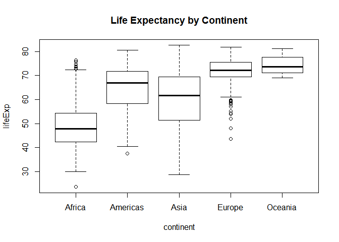
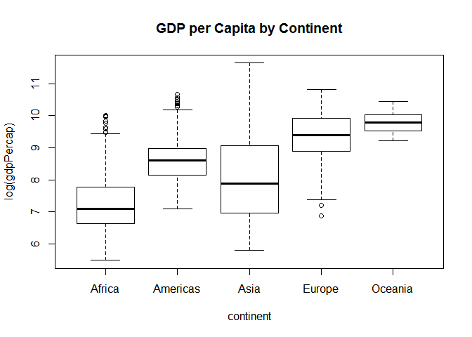
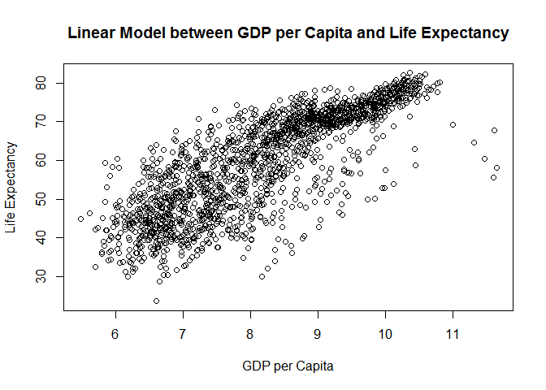

hw01\_gapminder.Rmd
================
Shirlett
September 18, 2017

Description Of Gapminder Data
-----------------------------

``` r
library(tidyverse)
```

    ## Warning: package 'tidyverse' was built under R version 3.3.3

    ## Loading tidyverse: ggplot2
    ## Loading tidyverse: tibble
    ## Loading tidyverse: tidyr
    ## Loading tidyverse: readr
    ## Loading tidyverse: purrr
    ## Loading tidyverse: dplyr

    ## Warning: package 'ggplot2' was built under R version 3.3.3

    ## Warning: package 'tibble' was built under R version 3.3.3

    ## Warning: package 'tidyr' was built under R version 3.3.3

    ## Warning: package 'readr' was built under R version 3.3.3

    ## Warning: package 'purrr' was built under R version 3.3.3

    ## Warning: package 'dplyr' was built under R version 3.3.3

    ## Conflicts with tidy packages ----------------------------------------------

    ## filter(): dplyr, stats
    ## lag():    dplyr, stats

``` r
library(gapminder)
```

    ## Warning: package 'gapminder' was built under R version 3.3.3

``` r
#This shows the first few records in the file
head(gapminder)
```

    ## # A tibble: 6 x 6
    ##       country continent  year lifeExp      pop gdpPercap
    ##        <fctr>    <fctr> <int>   <dbl>    <int>     <dbl>
    ## 1 Afghanistan      Asia  1952  28.801  8425333  779.4453
    ## 2 Afghanistan      Asia  1957  30.332  9240934  820.8530
    ## 3 Afghanistan      Asia  1962  31.997 10267083  853.1007
    ## 4 Afghanistan      Asia  1967  34.020 11537966  836.1971
    ## 5 Afghanistan      Asia  1972  36.088 13079460  739.9811
    ## 6 Afghanistan      Asia  1977  38.438 14880372  786.1134

``` r
#This gives a cursory description 
summary(gapminder)
```

    ##         country        continent        year         lifeExp     
    ##  Afghanistan:  12   Africa  :624   Min.   :1952   Min.   :23.60  
    ##  Albania    :  12   Americas:300   1st Qu.:1966   1st Qu.:48.20  
    ##  Algeria    :  12   Asia    :396   Median :1980   Median :60.71  
    ##  Angola     :  12   Europe  :360   Mean   :1980   Mean   :59.47  
    ##  Argentina  :  12   Oceania : 24   3rd Qu.:1993   3rd Qu.:70.85  
    ##  Australia  :  12                  Max.   :2007   Max.   :82.60  
    ##  (Other)    :1632                                                
    ##       pop              gdpPercap       
    ##  Min.   :6.001e+04   Min.   :   241.2  
    ##  1st Qu.:2.794e+06   1st Qu.:  1202.1  
    ##  Median :7.024e+06   Median :  3531.8  
    ##  Mean   :2.960e+07   Mean   :  7215.3  
    ##  3rd Qu.:1.959e+07   3rd Qu.:  9325.5  
    ##  Max.   :1.319e+09   Max.   :113523.1  
    ## 

``` r
#This gives more detailed statistical descriptions for each continent 
library(psych)
```

    ## 
    ## Attaching package: 'psych'

    ## The following objects are masked from 'package:ggplot2':
    ## 
    ##     %+%, alpha

``` r
describeBy(gapminder, group="continent")
```

    ## $Africa
    ##            vars   n       mean          sd     median    trimmed
    ## country*      1 624      70.50       40.78      75.50      70.00
    ## continent*    2 624       1.00        0.00       1.00       1.00
    ## year          3 624    1979.50       17.27    1979.50    1979.50
    ## lifeExp       4 624      48.87        9.15      47.79      48.30
    ## pop           5 624 9916003.14 15490923.32 4579311.00 6443586.30
    ## gdpPercap     6 624    2193.75     2827.93    1192.14    1557.04
    ##                   mad      min          max        range skew kurtosis
    ## country*        53.37     3.00       142.00       139.00 0.07    -1.25
    ## continent*       0.00     1.00         1.00         0.00  NaN      NaN
    ## year            22.24  1952.00      2007.00        55.00 0.00    -1.22
    ## lifeExp          8.58    23.60        76.44        52.84 0.56     0.13
    ## pop        5540860.93 60011.00 135031164.00 134971153.00 3.55    17.02
    ## gdpPercap      775.32   241.17     21951.21     21710.05 3.53    15.78
    ##                   se
    ## country*        1.63
    ## continent*      0.00
    ## year            0.69
    ## lifeExp         0.37
    ## pop        620133.24
    ## gdpPercap     113.21
    ## 
    ## $Americas
    ##            vars   n        mean          sd     median     trimmed
    ## country*      1 300       65.04       42.30      54.00       63.05
    ## continent*    2 300        2.00        0.00       2.00        2.00
    ## year          3 300     1979.50       17.29    1979.50     1979.50
    ## lifeExp       4 300       64.66        9.35      67.05       65.50
    ## pop           5 300 24504795.00 50979430.20 6227510.00 10642390.82
    ## gdpPercap     6 300     7136.11     6396.76    5465.51     5823.60
    ##                   mad       min          max        range  skew kurtosis
    ## country*        48.93      5.00       137.00       132.00  0.38    -1.23
    ## continent*       0.00      2.00         2.00         0.00   NaN      NaN
    ## year            22.24   1952.00      2007.00        55.00  0.00    -1.23
    ## lifeExp          8.47     37.58        80.65        43.07 -0.73    -0.21
    ## pop        5972602.95 662850.00 301139947.00 300477097.00  3.37    11.43
    ## gdpPercap     3269.33   1201.64     42951.65     41750.02  2.83     9.42
    ##                    se
    ## country*         2.44
    ## continent*       0.00
    ## year             1.00
    ## lifeExp          0.54
    ## pop        2943298.78
    ## gdpPercap      369.32
    ## 
    ## $Asia
    ##            vars   n        mean           sd      median     trimmed
    ## country*      1 396       79.48        38.18       73.00       81.18
    ## continent*    2 396        3.00         0.00        3.00        3.00
    ## year          3 396     1979.50        17.28     1979.50     1979.50
    ## lifeExp       4 396       60.06        11.86       61.79       60.62
    ## pop           5 396 77038721.97 206885204.62 14530830.50 25678311.84
    ## gdpPercap     6 396     7902.15     14045.37     2646.79     4915.85
    ##                    mad      min          max        range  skew kurtosis
    ## country*         35.58      1.0        140.0        139.0 -0.29    -0.58
    ## continent*        0.00      3.0          3.0          0.0   NaN      NaN
    ## year             22.24   1952.0       2007.0         55.0  0.00    -1.23
    ## lifeExp          13.00     28.8         82.6         53.8 -0.40    -0.67
    ## pop        18326690.66 120447.0 1318683096.0 1318562649.0  4.11    16.93
    ## gdpPercap      2820.83    331.0     113523.1     113192.1  4.42    25.56
    ##                     se
    ## country*          1.92
    ## continent*        0.00
    ## year              0.87
    ## lifeExp           0.60
    ## pop        10396372.70
    ## gdpPercap       705.81
    ## 
    ## $Europe
    ##            vars   n        mean          sd     median     trimmed
    ## country*      1 360       71.33       41.60      64.00       72.12
    ## continent*    2 360        4.00        0.00       4.00        4.00
    ## year          3 360     1979.50       17.28    1979.50     1979.50
    ## lifeExp       4 360       71.90        5.43      72.24       72.39
    ## pop           5 360 17169764.73 20519437.65 8551125.00 13215590.75
    ## gdpPercap     6 360    14469.48     9355.21   12081.75    13532.97
    ##                   mad       min         max       range  skew kurtosis
    ## country*        58.56      2.00      134.00      132.00 -0.09    -1.37
    ## continent*       0.00      4.00        4.00        0.00   NaN      NaN
    ## year            22.24   1952.00     2007.00       55.00  0.00    -1.23
    ## lifeExp          4.43     43.59       81.76       38.17 -1.25     3.29
    ## pop        6626994.42 147962.00 82400996.00 82253034.00  1.57     1.30
    ## gdpPercap     8846.05    973.53    49357.19    48383.66  0.85     0.14
    ##                    se
    ## country*         2.19
    ## continent*       0.00
    ## year             0.91
    ## lifeExp          0.29
    ## pop        1081469.32
    ## gdpPercap      493.06
    ## 
    ## $Oceania
    ##            vars  n       mean         sd     median    trimmed        mad
    ## country*      1 24      49.00      43.92      49.00      49.00      63.75
    ## continent*    2 24       5.00       0.00       5.00       5.00       0.00
    ## year          3 24    1979.50      17.63    1979.50    1979.50      22.24
    ## lifeExp       4 24      74.33       3.80      73.66      74.19       4.00
    ## pop           5 24 8874672.33 6506342.47 6403491.50 8439348.35 5996394.97
    ## gdpPercap     6 24   18621.61    6358.98   17983.30   18059.97    6459.10
    ##                   min         max       range skew kurtosis         se
    ## country*         6.00       92.00       86.00 0.00    -2.08       8.97
    ## continent*       5.00        5.00        0.00  NaN      NaN       0.00
    ## year          1952.00     2007.00       55.00 0.00    -1.36       3.60
    ## lifeExp         69.12       81.23       12.11 0.37    -1.33       0.77
    ## pop        1994794.00 20434176.00 18439382.00 0.43    -1.48 1328101.59
    ## gdpPercap    10039.60    34435.37    24395.77 0.71    -0.21    1298.02
    ## 
    ## attr(,"call")
    ## by.data.frame(data = x, INDICES = group, FUN = describe, type = type)

Graphical Display by Continent
------------------------------

``` r
plot(lifeExp ~ continent, gapminder, main="Life Expectancy by Continent")
```



``` r
plot(log(gdpPercap) ~ continent, gapminder, main="GDP per Capita by Continent")
```



Exploration of Correlation between Life Expectancy and GDP per Capita
---------------------------------------------------------------------

``` r
cor(log(gapminder$gdpPercap), gapminder$lifeExp)
```

    ## [1] 0.8076179

``` r
model = lm(log(gapminder$gdpPercap)~gapminder$lifeExp)
plot(log(gapminder$gdpPercap), gapminder$lifeExp, main="Linear Model between GDP per Capita and Life Expectancy", xlab="GDP per Capita", ylab="Life Expectancy");abline(model)
```



``` r
coef(model)
```

    ##       (Intercept) gapminder$lifeExp 
    ##        3.54348892        0.07760143
